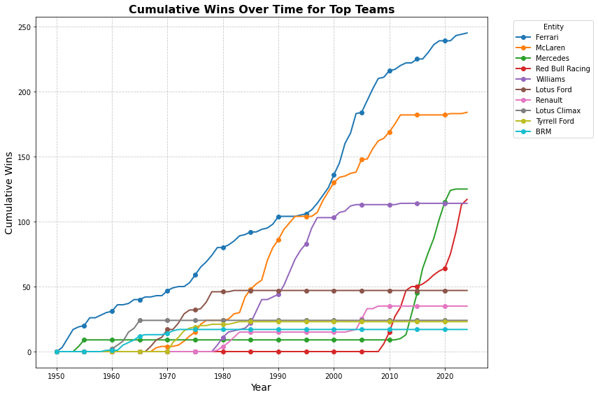
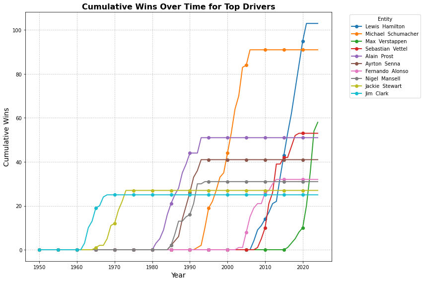
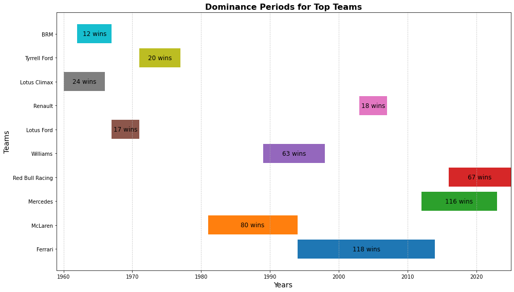
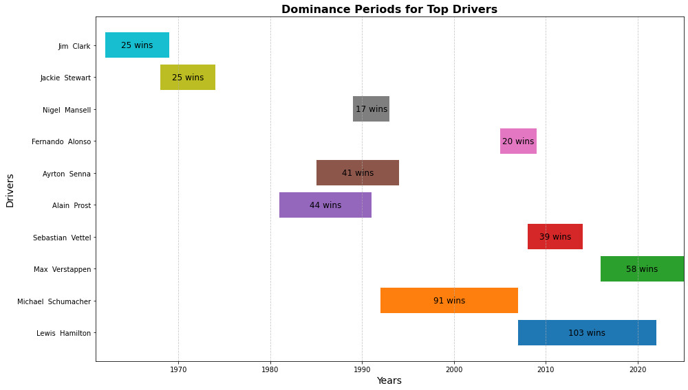
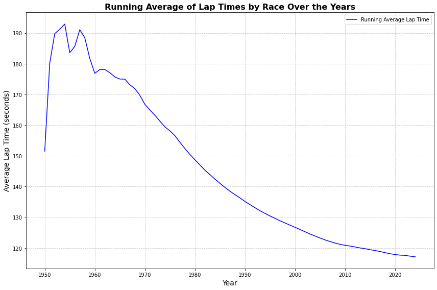
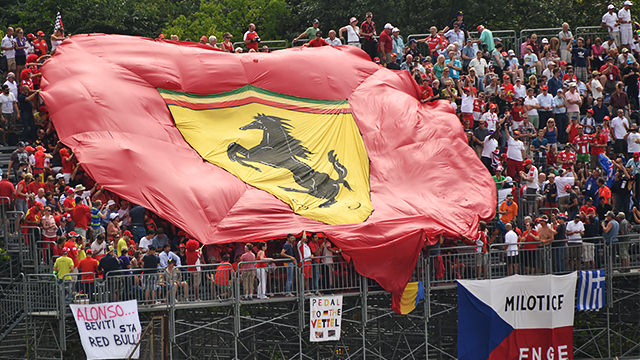

## Overview
This project involves exploratory data analysis (EDA) on historical Formula 1 race data, focusing on understanding trends and patterns among teams, drivers, and race characteristics over the years. 

## Dataset
The dataset used can be found at the following link: [Kaggle](https://www.kaggle.com/datasets/lakshayjain611/f1-races-results-dataset-1950-to-2024/data).
It contains: 
- **Total Rows**: 1,110
- **Columns**: `Grand Prix`, `Date`, `Winner`, `Car`, `Laps`, `Time`, `Name Code`
- **Time Range**: Covers races from 1950 onwards
- **Key Features**:
  - **Grand Prix**: The name of the race event
  - **Date**: Date of the race
  - **Winner**: The name of the winning driver
  - **Car**: The car/constructor used by the winner
  - **Laps**: Number of laps completed in the race
  - **Time**: The total time taken to win the race

## Analyses

### 1. Cumulative Wins Over Time
- **Objective**: Track the progression of cumulative wins for teams and drivers.
- **Visualization**: Line plots show the accumulation of wins, highlighting periods of dominance.
  We see in the cumulative team wins chart that Scuderia Ferrari have always been the top team in racing. 
  However, with recent struggles and epic runs by Red Bull and Mercedes, they have entered the conversation, along with Mclaren. 
  
  

  Based on driver wins over time, it is hard to deny that Lewis Hamilton is the greatest racer of all time. 
  Max Verstappen's astonishing trajectory may indicate that he'll threaten this title. 
  
  

### 2. Dominance Periods
- **Objective**: Identify specific periods when teams or drivers were dominant.
- **Visualization**: Time dependent bar plot shows dominant eras for teams and drivers
  Team dominance shows how Ferrari got their lead in the wins category, but also exposes their recent absence. 
  Hopefully Leclerc and Hamilton be catalysts of change in 2025. 
  
  
  Driver dominance periods further demonstrate Verstappen and Hamilton's recent grip on the sport. 
  
  

### 3. Race Characteristics: Lap Times and Evolution
- **Objective**: Examine the evolution of average lap times in races.
- **Visualization**: Time series of the average lap time over each year shows the trend of speed in the sport
  A running average of lap times shows improvements in race speeds over time, influenced by technological advancements and changes in regulations. 
  However, we see lap times in the 1960s became slower due to regulatory changes, including reduced engine capacities and an increased focus on safety. 
  

## Conclusion
Scuderia Ferrari is clearly the most decorated team historically, but we need to reverse the narrative of recent years. 

  

## Future Work
- **Deep Dive into Specific Eras**: More detailed analysis of specific periods or drivers.
- **Comparison of Team Strategies**: Analyzing pit stop strategies, tyre choices, and other tactical decisions.
- **Impact of Technological Changes**: Study how specific technological innovations impacted race outcomes.
